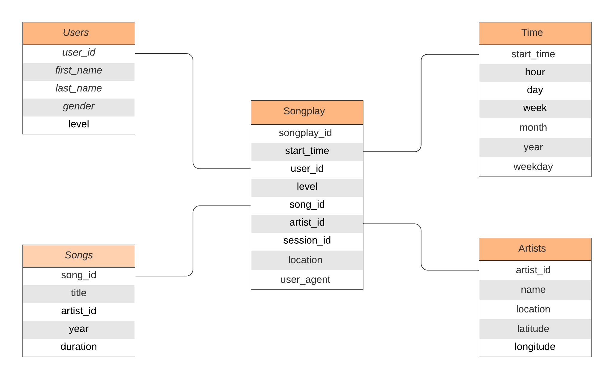

# Project 1
## Data Modeling with Postgres

### PROJECT SUMMARY
In this project, User activity data for a music streaming app called Sparkify was modelled.A relational database and ETL pipeline was designed to optimize queries for understanding what songs users are listening to. In PostgreSQL, Fact and Dimension tables were created, and data was inserted into the new tables.

### PROJECT SCHEMA
Star Schema was used for the development of the database.
4 Dimension tables and a single fact table was used.
The ER Diagram for the project -



### PROJECT FILES

1. create_tables.py - Python script used to connect to the 'sparkifydb' database. It returns the connection and cursor to sparkifydb. It drops the tables in the database if previously created. The script then creates all the tables with the help of queries in sql_queries.py. Finally, the script closes the connection. To execute this file, run the following command in Terminal - ``` python create_tables.py ```

2. sql_queries.py - The script that specifies all the queries required in the project. For Example, CREATE TABLE Queries, DROP TABLE Queries etc.

4. etl.ipynb - This notebook is used to create a trial pipeline for moving the data from JSON Files to the created database and its tables.

3. etl.py - This is the script for creating the main ETL Pipeline. It takes data from the JSON files with the help of the Pandas library.  To execute this file, run the following command in Terminal - ``` python etl.py ```

5. test.ipynb - This notebook is used for testing and running the SQL queries.


Thankyou :sparkles: